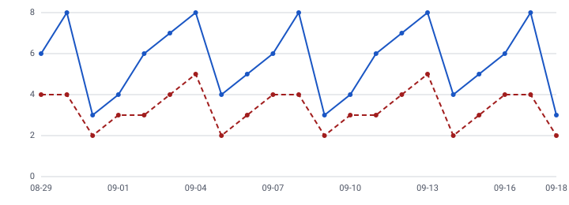

# grainview

A dashboard for [eventgrain](https://github.com/sriharifortitude/eventgrain):
series, funnel and retention views over a project's events, with charts a
screen reader can read, a data table behind every picture, saved views,
and CSV download. One page, no chart library, no state library.

*The image above is the SeriesChart component rendered to SVG from a live
query by `scripts/render-sample.ts` — the same markup the app produces.*

## What it does

- **Connect** with a project API key. The key is kept in the tab's
  sessionStorage — it survives a reload, not a closed tab — and never in
  localStorage or a saved view.
- **Query**: event count or unique people bucketed by hour/day/week/month
  with an optional property filter and group-by; funnels of 2–10 ordered
  steps with a window; weekly retention cohorts. Event names come from
  the API; dates are whole days in the project's zone, with 7/30/90-day
  presets.
- **Charts that carry their meaning.** The series chart is an SVG with
  `role="img"`, a name, and a one-sentence description of the data (range,
  total, peak); the full numbers sit in a real table behind a "Show data"
  disclosure. Grouped series get distinct dash patterns as well as
  colours. The funnel *is* a table with a bar drawn inside each row; the
  retention grid *is* a table with a four-step heat fill behind percentages
  that are already the text.
- **Says where the numbers came from.** The API reports whether a series
  was answered from daily rollups or the raw table; the dashboard shows it.
- **Saved views** in localStorage, per browser. **CSV download** built
  from the result in the same shape as eventgrain's own export.

## Running it

    npm install
    EVENTGRAIN_URL=http://127.0.0.1:4200 npm run dev     # proxies /api to eventgrain

For production, `npm run build` writes `dist/`. Serve it from the same
origin as the API — `/` to these files, `/api` to eventgrain — and there
is no CORS to configure, which is deliberate: the dashboard has no
opinion about origins, and the API has no CORS headers to get wrong.
The Dockerfile does exactly that with nginx:

    docker build -t grainview .
    docker run -p 8080:8080 -e API_UPSTREAM=http://eventgrain:4200 grainview   # rootless nginx, uid 101

## Checks

    npm run typecheck
    npm run lint              # typescript-eslint strict + jsx-a11y strict
    npm test                  # scale/tick/path arithmetic, form validation, CSV: 15 tests
    npm run test:a11y         # axe-core on every view, keyboard and focus behaviour, app flow with a fake client: 12 tests

[ACCESSIBILITY.md](ACCESSIBILITY.md) lists what is verified and what is
not.

## Design notes

1. [Hand-written SVG, no chart library](docs/adr/0001-svg-without-a-chart-library.md)
2. [A chart is a picture with a caption; the table is the data](docs/adr/0002-picture-plus-table.md)

## What it deliberately does not do

- **No auth of its own.** It holds one API key for one project. Multiple
  projects means multiple tabs; users, roles and sharing belong to a
  product, not this repository.
- **No live refresh.** Run the query again. Auto-refresh on a dashboard
  that people leave open would poll the API for nothing.
- **No dark mode** yet. The palette is documented in `styles.css` with
  its contrast ratios; a dark set would need the same treatment.
- **Not translated.** English only; the message-table approach from
  openslot would apply directly.
- **No hover tooltips on the series chart.** A tooltip that only appears
  under a mouse is information that only mouse users get. The data table
  is the equivalent for everyone; a keyboard-focusable point pattern is a
  reasonable future addition.
- **Bundle size**: 305 kB, of which about 200 kB is `temporal-polyfill`
  used only for date-preset arithmetic. Replacing it with a few lines of
  `Date` code is the obvious diet; it was kept for consistency with the
  API's own date handling.

## Licence

Business Source License 1.1, same terms as eventgrain. Converts to Apache
2.0 on 2030-09-17. See [LICENSE](LICENSE).
